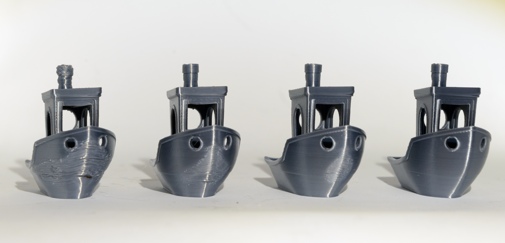
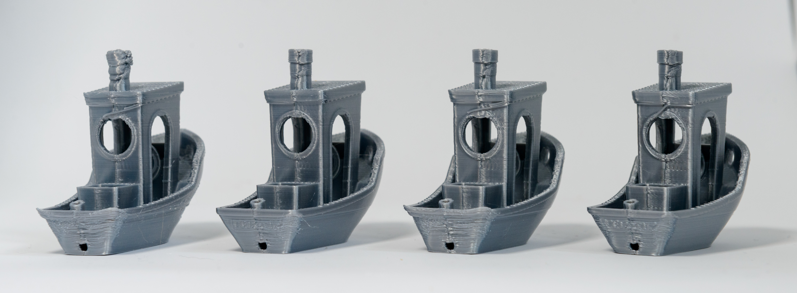

# Modular fan duct for Voron Afterburner

This project is aimed at improving the use of the airflow of the 5015 blower fan. It consists in a modular fan duct where the duct tips are separate parts allowing to itterate quickly on their design and replace them when needed.

Fusion 360 file is provided so you can experiment and make your own design for the nozzles.

## Printing and installation

The tips/duct nozzles are held in place by the screws of the hotend cooling fan that needs to be changed to M3x17 or 18 for that purpose

The lips located on the fan duct where the nozzle sits are relatively thin. You may need to decrease your extrusion witdh in your slicer for them to be correctly sliced. I used an extrusion width of 0.35 mm in PrusaSlicer

## Compatibility

The duct is available for all supported toolheads (Mosquito, E3DV6, Dragon), however it was only tested on a Mellow NF Crazy mosquito clone

## Cooling improvements

Regarding improvement on cooling, below is a comparison of, from left to right, stock cooling (4020 blower fan/stock duct), 5015 blower fan with stock duct, 5015 blower fan with a previous iteration of nozzle design, 5015 blower fan with current iteration of nozzle design

The Benchies are printed with a PLA that requires a hell of cooling (Fiberlogy Fibersilk PLA). A regular PLA could produce a good Benchy with the stock cooling. The advantages of using this hard to cool PLA is that since you get a flawed Benchy you can see the improvements on cooling that are achieved

An overview of tested nozzle configurations

## Using the duct with the stock 4020 cooling

The modular duct is normally intended to complement the 5015 mod and was optimized for that. You can however use if with the stock cooling. Below is a comparison between the stock duct (left) and the modular duct with its current nozzle

