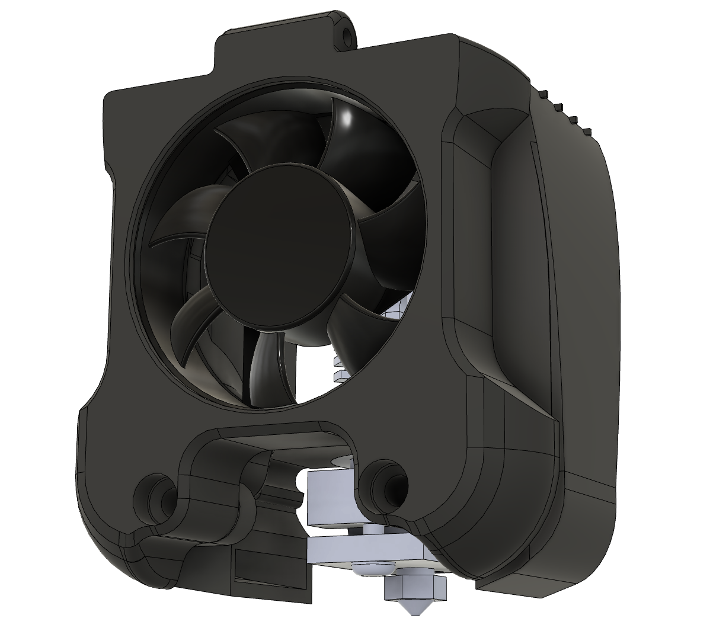

# The Warbird fan duct

This project is aimed at providing a more efficient fan duct for the 4020 stock cooling fan. The design is based on what has been learned through the experimentations that have been carried out regarding afterburner optimization

 

Fusion 360 file is provided so you can experiment and make your own design for the nozzles.

## Printing and installation

The fan duct has 2 temporary supports whose purpose if to keep the inlet of the duct straight so they do not deform during printing. They can be easily removed once the print is completed 

Installation is the same as the stock duct. The location of the screws to attach the hotend fan cover has been changed, this is why there is also a new fan cover

**Do not print it in eSun ABS+ and use a sock on your heat block else it will very likely melt** 

## Compatibility

The duct is available for Mellow NF Crazy (Mosquito clone), E3DV6 and  Dragon, however it was only tested on the Mellow NF Crazy.

On a genuine Mosquito, the tips of the duct may be too close to the heat block

## Cooling improvements

Regarding improvement on cooling, below is a comparison.

On the left is the stock cooling, in the middle is the stock 4020 fan with the Warbird and on the right is also the Warbird with the 4020 fan but using a standard PLA

The 2 Benchies on the left are printed with a PLA that requires a lot of cooling (Fiberlogy Fibersilk PLA). The advantage of using this hard to cool PLA is that since you get a flawed Benchy you can easily see the improvements on cooling that are achieved

Here is the CFD simulation of the duct if you fancy that

 

## Using the fan duct with the 5015 fan mod

There is no problem to use this fan duct with the 5015 fan mod.

