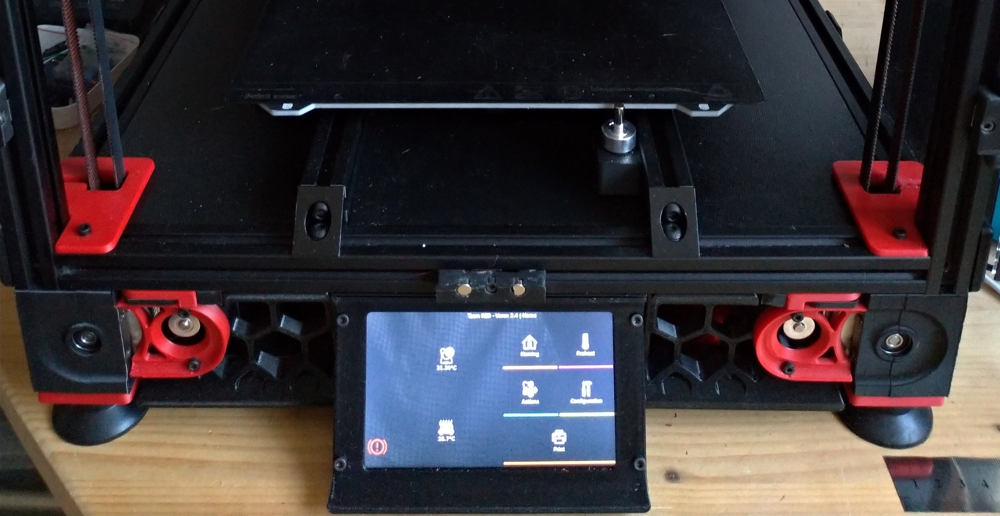

# Bigtreetech Pi TFT50 Mount for V2.4 250

This is a simple (non swiwel) mount that allows to integrate a 5" PI TFT50 on a Voron V2.4 250.

Custom skirts are required since the TFT is larger than the stock display. Only one skirt part is provided, the other one can be obtained by mirroring the STL

Only the modified skirt for a 250 mm size is provided. For other sizes, the length of each original skirt part must be shortened by 9mm to make room for the TFT

